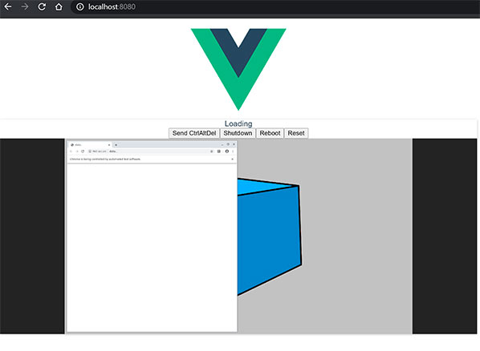

# frame-vnc-selenoid
### noVnc окно в Vue.js приложеннии
  

### Установка
```sh
npm install
```

### Настройка
src\components\segmentfault.vue
```js
 url: 'ws://192.168.99.105:4444/vnc/40ec9a1416f7b41c303615c2605745b0',
```

### Запуск
```sh
npm start
```
